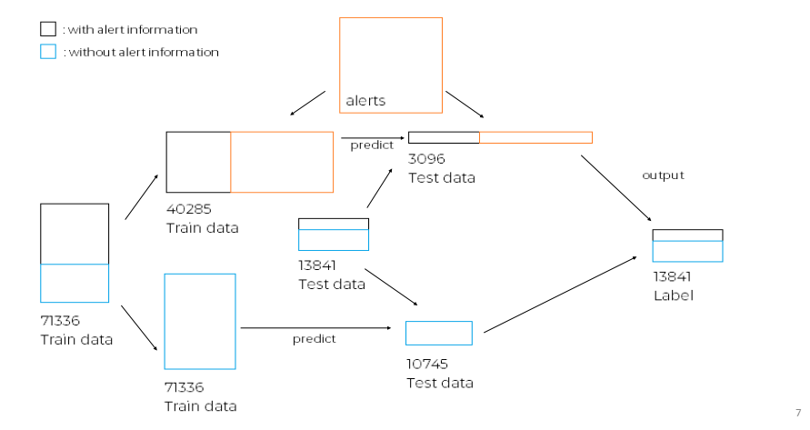
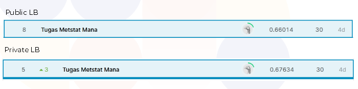

# irregularities-phenomenon-dsw
Data National Hackathon by Data Science Indonesia collaborate with Jabar Digital Services 

* Team name : Tugas Metstat Mana  
* Team member : Maxwell Thomson

## Irregularities Phenomenon Prediction : Competition Overview
> The competition will use Waze data information from Jabar Digital Service, start from September 2020 to November 2020. The data covers 3 busiest areas in West Java, Bandung, Bogor, and Bekasi. The last week of November information will be kept as a data test, meanwhile, the rest of the data will be used for training.

>JDS has records of more than 7.5 million Waze reports generated by users which happen on that range and cities. There also 350k irregularities reports identified by the Waze system as irregular or atypical by taking into account historical speed data for the same day of the week and hour.

>DSI and JDS invites teams to develop a model that can predict the high reports or irregularities phenomenon on certain areas, dates, and hours around the last week of November 2020.

In this competition, we are given 4 datasets, *data_train*, *data_test*, *alerts* and *irregularities*. However, the irregularities phenomenon will be predicted by using only *data_train* and *alerts* data. Look at the diagram below. 

The test data will be predicted by using 2 different model separately. Test data that contains alert information will be predicted by train data that has been merged with alert information. Meanwhile, the rest test data that doesn't contain alert information will be predicted by the original train data. Then, these two output will be combined together as the final output.

## Model Performance

Model was evaluated using macro F1 metric.

(*SMOTE technique was applied to both dataset and hyperparameter has been tuned*)

| Classifier  | 1st Dataset | 2nd Dataset (+ alerts) |
| ------------- | ------------- | ------------- |
| Random Forest | 0.57 | 0.744 |
| XGBoost | 0.57  | 0.7686 |
| Logistic Regression | 0.567  | 0.761 |
| Naive Bayes | 0.532  | 0.756 |
| KNN | 0.556  | 0.725 |

## Result

The random forest model achieved a good performance on 70% unseen test data (private leaderboard).

## Code and Resources Used 
* **Python Version:** 3.8.5
* **Packages:** pandas, numpy, matplotlib, seaborn, sklearn
* **Link:** https://www.kaggle.com/c/danthon2021
